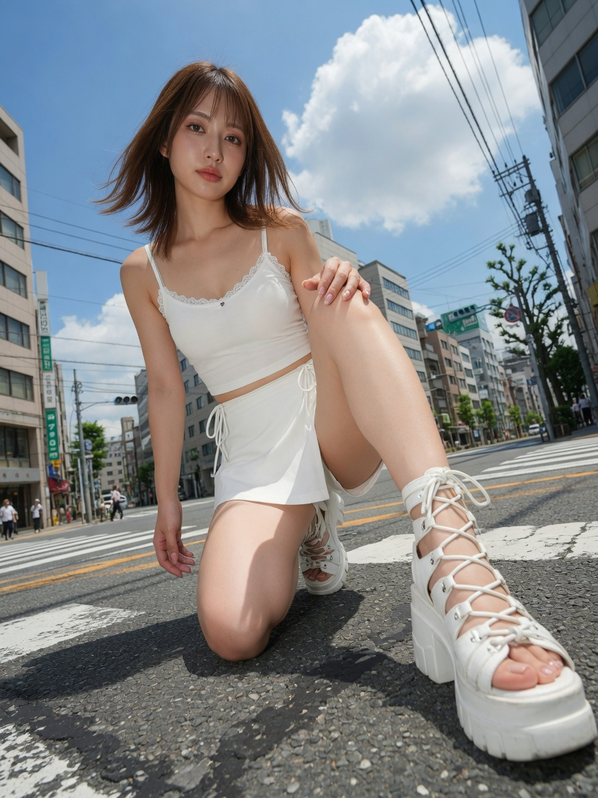

Last updated on 2026-08-28 21-34-27

# Awesome Kling AI 🎬

[](https://github.com/sindresorhus/awesome) [](./LICENSE) [](https://github.com/DSeaStar/awesome-kling/stargazers)

| [简体中文](./README.md) | [English](./README-en.md) |

> A curated collection of the **best Kling AI / Kling 3.0 prompts**, **text-to-image (T2I)** fashion briefs, video generation techniques, Motion Control workflows, and developer resources for **Kuaishou Kling**.

This repository focuses on **high-fidelity Kling prompts** for Kling 3.0 / Omni, I2V & Seedance (from X), T2I portraits, cinematic film, advertising, UGC, anime, short drama, and VFX — plus **API guides**, SDKs, and production workflows so you can ship real products on top of Kling.

Inspired by [awesome-seedance](https://github.com/ZeroLu/awesome-seedance) (sibling list). See [CONTRIBUTING-en.md](./CONTRIBUTING-en.md) and the [weekly crawl log](./docs/x-crawl-log.md).

---

## 📖 Table of Contents

> **Ordering rule:** New prompts always go first within each section. **Kling 3.0 / Omni** is pinned to the top.

1. [Kling 3.0 / Omni](#1-kling-30--omni)
2. [Image-to-Video I2V (from X)](#2-image-to-video-i2v-from-x)
3. [Seedance Prompts (from X)](#3-seedance-prompts-from-x)
4. [Text-to-Image (T2I)](#4-text-to-image-t2i)
5. [Prompt Formula (Start Here)](#5-prompt-formula-start-here)
6. [Cinematic Film Styles](#6-cinematic-film-styles)
7. [Advertising & Commercial Branding](#7-advertising--commercial-branding)
8. [Social Media & Viral Memes](#8-social-media--viral-memes)
9. [UGC Style](#9-ugc-style)
10. [Anime & Animation Styles](#10-anime--animation-styles)
11. [Short-form Drama & Web Series](#11-short-form-drama--web-series)
12. [Visual Effects & Experimental Styles](#12-visual-effects--experimental-styles)
13. [Motion Control & Character Consistency](#13-motion-control--character-consistency)
14. [Resources (API, SDK & How-to-use)](#14-resources)
15. [Contributing](#15-contributing)
16. [Star History](#16-star-history)

---

## 1. Kling 3.0 / Omni

Prompts for **Kling 3.0 / Pro / VIDEO 3.0 Omni** — multi-shot, native audio, Elements, Motion Control. Full pack: [`prompts/kling-3-omni.md`](./prompts/kling-3-omni.md) · Negatives: [`prompts/negative-prompts.md`](./prompts/negative-prompts.md) · Workflows: [`prompts/workflows.md`](./prompts/workflows.md) · Comparison: [`docs/model-comparison.md`](./docs/model-comparison.md)

> **Newest first.**

### 1.1. Late-night rehearsal vlog (native dialogue)

*Source: [@YourAlphaMom](https://x.com/YourAlphaMom/status/2085350644915765377) (same-prompt bake-off including Kling 3.0 Pro)*

```text
CAMERA: DV 16mm handheld selfie vlog; natural shake; imperfect framing; camera body never visible.
LOOK: Soft tape look, mild grain, realistic skin.
STYLE: Late-night post-practice, tired but happy, intimate.
CHARACTER: Brunette model mid-20s, athletic long-sleeve + joggers, light sweat.
SETTING: Empty dance studio at night, mirrors, wooden floor, water bottle + towel.
STORYBOARD (~2s each): enter out of breath "Finally done… it's way too late." → pan empty studio → drink water "I really needed that." → short dance combo laugh → selfie wave "Okay, I'm going home. Good night."
```

### 1.2. Overhead food B-roll (one shot)

*Source: [@emberbuild](https://x.com/emberbuild/status/2085252050053435406)*

```text
Overhead food B-roll, Kling 3.0, single continuous shot. Batter hits a hot pan; edges crisp; steam in morning light; slow drift; photoreal; no text.
```

### 1.3. Omni block template

```text
[MODE] Kling 3.0 Omni · multi-shot · native audio on
[SUBJECT] …  [ACTION] …  [SETTING] …
[CAMERA] shot · angle · move
[AUDIO] "dialogue" · SFX · ambience
[TIMELINE] [0-3s] Shot 1 — …  [3-7s] Shot 2 — …
[QUALITY] photoreal, stable identity, 4K
```

Official: [Omni User Guide](https://kling.ai/quickstart/klingai-video-3-omni-model-user-guide) · [Prompt Guide](https://kling.ai/blog/kling-ai-prompt-guide)

---

## 2. Image-to-Video I2V (from X)

Kling **image-to-video** prompts crawled from public X posts. Full pack: [`prompts/i2v-from-x.md`](./prompts/i2v-from-x.md) · Log: [`docs/x-crawl-log.md`](./docs/x-crawl-log.md) · **Weekly auto candidates (Mondays)**

> **Newest first** in this section and repo-wide.

### 2.1. Kling 2.1 I2V Collection (highlights)

*Source: [MayorkingAI (@MayorKingAI)](https://x.com/MayorKingAI) — [Thread](https://x.com/MayorKingAI/status/1927126460352893348)*

```text
Tracking shot following a warrior woman riding a massive white wolf running at high speed across a frozen tundra, snow flying up from paws, wind whipping her cloak, cold blue tones, dramatic atmosphere, cinematic realism
```

```text
Aerial tracking shot of two cars drifting around a neon-lit Tokyo highway curve, tire smoke rising, reflections shimmering on wet asphalt. Electric atmosphere, dynamic, intense
```

```text
Slow zoom in on the face of a Korean Man in an elegant tailored suit, looking directly into the camera, centred composition, smoking a cigarette, soft smoke rising, soft ambient light with green and red neon reflections, melancholic expression, cinematic lighting with vintage colour gradation, inspired by Wong Kar-wai's style
```

### 2.2. Kling 2.0 I2V Collection (highlights)

*Source: [MayorkingAI](https://x.com/MayorKingAI/status/1914431899675869327)*

```text
FPV chase cam shot closely tailing a wingsuit flyer diving between narrow cliffs. Arms stretched, wings rippling, sharp mountain edges blur below, crisp sky, sun flaring through peaks, fast shutter, thrilling, adrenaline
```

```text
Slow-motion cinematic tracking shot, a massive whale breaches the ocean surface, glowing from the golden sunset behind. Water cascades off its body, birds scatter mid-air, mountains silhouette in the background. Rippling reflections shimmer. Majestic, awe-inspiring
```

### 2.3. Cloud palace I2V (minimal camera)

```text
Slow push-in, light cloud drift, figure walks slowly, preserve depth and restrained palette, cinematic, 4K
```

### 2.4. Detail-forcing I2V template

*Source: [@creatorslop](https://x.com/creatorslop/status/2085350375784378440)*

```text
Generate a video of [your scene] and include these details: the texture of every major surface, the direction and temperature of the light source, the speed of any movement in the frame, what the background is doing while the subject is in focus, and whether shadows are sharp or soft. Every element should feel chosen, not random.
```

---

## 3. Seedance Prompts (from X)

**Seedance 2.0 / 2.5** prompts crawled from X (shot structure ports well to Kling). Full pack: [`prompts/seedance-from-x.md`](./prompts/seedance-from-x.md)

### 3.1. Roswell 1947 archival film (Seedance 2.5)

*Source: [@soumyattention](https://x.com/soumyattention/status/2085947512582721619)*

```text
[Generation Goal] Recovered-archival 1947 Roswell military documentation film (B&W 16mm grain, scratches, degraded mono audio). Stages: (0-8s) ridge handheld + soldiers order camera off; (8-15s) debris inspection + stretcher; (15-27s) tent gurney alien thrashing; (27-30s) film leader fail. Lock uniforms, alien identity, no modern objects.
```

### 3.2. Premium coffee machine UGC 30s (Seedance 2.5)

*Source: [@SadiaMalik182](https://x.com/SadiaMalik182/status/2085947010293883115)*

```text
Create a 30-second vertical AI UGC product commercial (9:16) for a premium coffee machine.
Style: Ultra-realistic, cinematic UGC, 4K HDR, natural lighting, smooth handheld.
Scene 1 (0-5s) creator enters kitchen with mug: "I finally tried this coffee machine."
Scene 2 (5-10s) beans, water, power button close-ups.
Scene 3 (10-17s) grind, crema, pour, golden morning light.
Scene 4 (17-23s) first sip smile: "This honestly tastes amazing."
Scene 5 (23-27s) product orbit showcase.
Scene 6 (27-30s) hero product + cup, creator smiles to camera.
```

### 3.3. Morning commute 15-shot table (Seedance 2.5)

*Source: [@AIwithSynthia](https://x.com/AIwithSynthia/status/2085943905577734483)*

```text
SHOT 1 ECU phone alarm on sheets → SHOT 2 jolt awake → face wash → toothbrush → fridge POV grab → egg/toast pan → rushed bite → outfit change → shoes lace → corridor rush → metro doors → office badge → keyboard OTS → collapse on bed. Match cuts + SFX per shot.
```

### 3.4. Cat propeller helmet one-take (Seedance 2.0)

*Source: [@saniaspeaks_](https://x.com/saniaspeaks_/status/2085932310923251950)*

```text
Single continuous shot: woman places spinning propeller fan helmet on silver tabby cat, rides scooter; cat lifts and flies beside scooter with dangling legs and flowing fur; handheld smartphone track; photoreal; no cuts.
Negative: cartoon, extra limbs, floating without propeller, text, watermark.
```

### 3.5. Visual Production Graph workflow

*Source: [@HBCoop_](https://x.com/HBCoop_/status/2050246433480020154)*

Compress character + world + layout + shot sequence into one control image; text only handles timing / camera / shot order. See full Seedance pack.

---

## 4. Text-to-Image (T2I)

Kling Image / 可灵生图 prompts. Full multi-language packs live under [`prompts/`](./prompts/).

> In this section (and every category in this repo): **new prompts always go first**.

### 4.1. 青空を踏む白 / White Stepping on Blue Sky

*Extreme low-angle summer crosswalk fashion portrait — pure white outfit, vivid blue sky, wide-angle leg foreground. Aspect **3:4**.*



**Prompt (English, paste-ready):**
```text
Vertical 3:4 photoreal fashion portrait. Extreme low-angle wide close shot from asphalt height at a wide Japanese summer intersection. Woman in her 20s: right knee down (left of frame), left knee raised high toward camera (right of frame), white chunky lace-up platform sandal filling lower-right foreground with strong wide-angle perspective. Calm downward gaze to the low camera, face slightly tilted. Soft features, elongated brown eyes, natural undereye, soft bright brown brows, clean nose, translucent coral-pink lips; sheer pink-beige eyeshadow, subtle blush. Bright brown shoulder-length medium hair, thin sheer bangs, face-framing layers, light wind in the tips. White thin-strap ribbed cropped camisole with lace trim; white high-waist wrap mini skort with gathers and thin drawstring; white thick-soled lace-up sandals. Left hand resting on raised left knee; right hand near asphalt. Mid-rise buildings, street trees, poles, transformers, tangled wires converging skyward, crosswalk, tiny pedestrians; upper frame vivid blue sky and white cumulus. Hard high summer sun, sharp asphalt shadows. Natural skin texture, clear fabric and sandal-lace detail, sharp face and foreground leg, slightly softer background. Fresh blue-and-white summer grade, warm skin tones, no heavy beauty filter, no exaggerated HDR. Not mirrored.
```

**Negative:**
```text
mirrored / left-right flip, left hand detached from raised left knee, deformed toes, deformed sandal straps, extra limbs, warped anatomy
```

**Full pack (日本語 / 中文 / English structured + I2V follow-up):**  
[`prompts/t2i-fashion-portraits.md`](./prompts/t2i-fashion-portraits.md)

---

## 5. Prompt Formula (Start Here)

Kling 3.0 responds best to **cinematic direction**, not keyword soup. Full breakdown: [`prompts/prompt-formula.md`](./prompts/prompt-formula.md).

### Core template

```text
[Subject], [Action], in [Setting].
Camera: [shot type], [movement], [lens / DOF].
Lighting: [key light], [mood].
Style: [film reference], photorealistic, high detail, 4K.
Audio (optional): [dialogue / SFX / ambience].
```

### Multi-shot template (Kling 3.0 strength)

```text
Duration: 10s. Multi-shot sequence. Keep wardrobe and weather consistent.

[0-3s] Shot 1 — Extreme wide establishing:
...

[3-7s] Shot 2 — Medium tracking:
...

[7-10s] Shot 3 — Extreme close-up:
...
```

### Image-to-Video template

```text
Animate the subject in the reference image.
Motion: [specific motion].
Camera: [push-in / pan / orbit / static].
Keep face identity, clothing, and background layout consistent.
Natural motion blur, realistic physics, photorealistic.
```

Commercial playbooks (CN): [`prompts/commercial-use-cases.md`](./prompts/commercial-use-cases.md)

---

## 6. Cinematic Film Styles

Professional cinematic approaches optimized for **Kling 3.0** multi-shot and native audio.

### 6.1. Hollywood Night Rain Racing

*Le Mans energy — dual-driver tension, wet asphalt, green-light launch.*

**Prompt:**
```text
Style: Hollywood professional racing film, cinematic night rain, high stakes.
Duration: 12s. Multi-shot.

[0-4s] Shot 1 — Interior close-up: veteran driver in helmet, rain lashes windshield, dashboard lights on visor, calm nod, mouths "Let's go."
[4-8s] Shot 2 — Rival cockpit: younger driver grips wheel, heavy breathing, adrenaline eyes, whispers "Focus."
[8-12s] Shot 3 — Wide action: starting lights turn green, both cars accelerate on wet asphalt, water sprays into lens, stadium lights streak with motion blur.

Photorealistic, IMAX feel, coherent faces, natural rain physics, 4K.
```

### 6.2. Denis Villeneuve Desert Escape

*Epic scale, desaturated palette, nature vs. machine.*

**Prompt:**
```text
Style: IMAX 70mm, Denis Villeneuve, gritty realism, desaturated, epic scale.
Duration: 12s.

[0-4s] Extreme wide: colossal sandstorm miles high swallows desert; tiny armored convoy races away; Hans Zimmer–style tension.
[4-8s] Cockpit cam: pilot screams "GO! GO!", violent camera shake, sand blasts windshield, sun blocked by dust wall.
[8-12s] Climax: rover launches off dune in slow motion, silhouette against dark storm, lightning inside dust cloud, debris past lens, cut to black.

Photorealistic, catastrophic scale, stable vehicle geometry.
```

### 6.3. Wong Kar-wai Rainy Phone Booth

*Nostalgic Hong Kong art-cinema mood with emotional restraint.*

**Prompt:**
```text
Film style: 90s Hong Kong art cinema, retro film grain, high ISO, amber-green color cast, melancholic.

Core emotional line (for performance): "If memories were canned food, I hope they never expire."
Duration: 10s.

[0-4s] Through rain-streaked glass of a red phone booth; figure in khaki trench coat holds receiver, eyes hollow yet deep; rain distorts face like oil paint.
[4-7s] Extreme close-up on lips and half face; soft whisper into receiver; neon bokeh drifts across skin.
[7-10s] Hangs up, walks into rainy crowd; frame-step / trailing motion blur on the back; city light trails.

Handheld, shallow DOF, emotionally intense, photorealistic film look.
```

### 6.4. Neon Tokyo Rain Sequence

*Blade Runner 2049 lighting language with timed shot escalation.*

**Prompt:**
```text
[0-4s] Wide establishing, static: neon-drenched Tokyo alley at night, heavy rain, reflections on wet asphalt, distant traffic murmur.
[4-8s] Medium, slow dolly forward: figure in black trench coat walks toward camera under red paper umbrella, neon flickering on face.
[8-12s] Close-up tracking: umbrella drops, rain hits face, looks up; rain sound intensifies.
[12-15s] Extreme close-up: raindrops hit neon puddle in slow motion, rings of reflected color, bass fades to silence.

Hyper-realistic, 8K feel, Blade Runner 2049 cinematography, Roger Deakins lighting.
```

### 6.5. Samurai at Sunset (Time-coded)

*Hitchcock vertigo + Kurosawa scale in one 15s beat.*

**Prompt:**
```text
[0-4s] Low-angle wide, static: lone samurai silhouetted against blood-red sunset on windswept ridge, tall grass bending, distant thunder.
[4-8s] Dolly zoom on face as realization hits — background warps (vertigo effect), drums building.
[8-12s] Whip pan into crane rise: army of a thousand torches advancing in the valley, war horns, smoke.
[12-15s] Extreme close-up: hand grips katana hilt, knuckles white, single sweat drop in slow motion, blade draw ring, then silence.

Hyper-realistic, 8K, Akira Kurosawa cinematography.
```

### 6.6. Jazz Pianist with Native Audio

*Performance scene — use Kling native audio / dialogue-friendly phrasing.*

**Prompt:**
```text
Close-up of a jazz pianist's hands flying across a grand piano in a smoky nightclub. Each keystroke ripples warm amber light on lacquered wood. Camera slowly pulls back to reveal upright bass, brushed drums, tenor saxophone. Musicians trade solos, nodding. Cigarette smoke curls through a single spotlight.

Hyper-realistic, intimate jazz club, 4K.
Audio: crisp piano attack, walking bassline, brushed snare, breathy sax melody, room reverb.
```

---

## 7. Advertising & Commercial Branding

Use **Kling AI** for product showcases, brand films, and high-end commercials.

### 7.1. Luxury Perfume Commercial (Time-coded)

**Prompt:**
```text
(0-3s) Macro of luxury perfume bottle among pink peonies, shallow DOF, petals floating in warm afternoon light, soft ambient music.
(3-7s) Camera glides closer; feminine hand enters from right, fingers touch glass; silk rustle.
(7-12s) Slow-motion spray: golden mist against dark background, atomizer hiss, rim light on particles.
(12-15s) Pull-out to hero frame, product centered, volumetric light, cream minimal background, elegant silence.

Hyper-realistic fashion commercial, 8K feel, product-stable geometry.
```

### 7.2. Sports Drink Ad

**Prompt:**
```text
Generate a premium 12-second sports drink commercial for the product in the reference image.
[0-3s] Macro: ice beads sliding down the bottle, side rim light, shallow DOF.
[3-7s] Athlete opens the bottle and drinks, slow-motion splash, urban track bokeh.
[7-10s] Fast cuts: sprint, high-five, bottle hero spin.
[10-12s] Product lockup, clean background, space for slogan.

Brisk pacing, high-end commercial grade, 4K, consistent bottle design.
```

### 7.3. Minimal Brand Lifestyle Film

**Prompt:**
```text
Create a 15-second lifestyle brand film for a minimalist home brand.
Natural indoor daylight, real people, no heavy filters.
Product appears naturally inside everyday scenes — no hard-sell overlays.
Camera: slow push-ins and empty-frame transitions.
Nordic / Japanese minimal aesthetic, calm voiceover space, soft ambient room tone.
```

### 7.4. Drone Product Replacement Ad

**Prompt:**
```text
Match the shot design and editing rhythm of reference video @video1.
Replace every product with the drone in reference image @image1.
Multi-angle showcase of body, propellers, and flight moment.
Color grade: blue and black. New VO and music about drone performance.
Keep product identity stable across all shots.
```

More commercial recipes: [`prompts/commercial-use-cases.md`](./prompts/commercial-use-cases.md)

---

## 8. Social Media & Viral Memes

Attention-first vertical and meme-ready setups for short platforms.

### 8.1. Giant Orange Cat City Meme

**Prompt:**
```text
Style: mockumentary mobile vlog, hyperrealistic CG + real city, 8K fur physics.
Duration: 15s. Vertical 9:16 preferred.

[0-5s] Bustling city street; camera tilts up to reveal a Godzilla-sized orange tabby stuck between skyscrapers, waving paws pitifully; glass deforms under huge paw pads.
[5-10s] Ground POV: traffic flows; giant cat sniffs a bus; driver calmly pets its nose; cat sneezes, blowing hats and leaves.
[10-15s] Cat squeezes free, sits on a bridge making it sag slightly, then lazily grooms itself blocking rush hour; freeze on innocent eyes.

Comedic, photoreal physics, stable giant-scale lighting.
```

### 8.2. Street Argument with On-screen Emphasis

**Prompt:**
```text
Tight medium shot of two eccentric adults on a rainy street corner in heated conversation.
One in oversized trench coat gestures wildly and says: "It's not just a pretzel — it's a sourdough pretzel!"
The other in denim jacket replies: "Who cares. A pretzel's a pretzel!"
Clear lip-sync, natural rain ambience, meme-ready framing, photorealistic.
```

### 8.3. One-Take Hook Vertical

**Prompt:**
```text
Vertical 9:16, 8 seconds, single continuous take.
Creator looks into lens in a messy bedroom, suddenly freezes mid-sentence, eyes widen, slowly turns to off-screen crash sound, then sprints out of frame.
Handheld phone aesthetic, natural noise, no music until the last beat drop.
```

---

## 9. UGC Style

User-generated aesthetics — phone camera energy with controlled surreal twists.

### 9.1. Bathroom Mirror Glitch Vlog

**Prompt:**
```text
Style: mockumentary vlog, hyperreal, fixed-camera real-shot feel, natural bathroom light, light suspense-comedy.
Duration: 15s.

[0-6s] Young woman brushes teeth in front of bathroom mirror, funny faces; reflection is perfectly normal and synced.
[6-11s] She spits, turns to leave; her reflection STAYS, raises an eyebrow mischievously for 2 seconds, then panics and fast-forwards to catch up before vanishing.
[11-15s] She stops at the door, turns back; mirror is empty and normal; confused look to camera; freeze.

Must feel like a "network delay" of the reflection, photoreal, no horror gore.
```

### 9.2. Product Unboxing UGC

**Prompt:**
```text
Phone selfie angle, slightly messy desk, natural window light.
Creator opens a package, genuine surprise reaction, holds product to camera, rotates it, points to 2 features while talking.
Casual English dialogue: "Okay wait — this packaging is actually insane."
UGC realism, mild handheld shake, authentic skin texture, 9:16.
```

### 9.3. Reference Character Speaks Audio

**Prompt:**
```text
Place the person from [Image2] inside the interior of [Image1], keeping the style of [Image2] but the realism of [Image1].
They say the line from [Audio1] with clear lip-sync.
Natural room light, stable identity, subtle head motion, photorealistic.
```

---

## 10. Anime & Animation Styles

Character action, style consistency, and dynamic motion tests.

### 10.1. Martial Arts Tournament Clash

**Prompt:**
```text
Figure 1 battles Figure 2 in a World Martial Arts Tournament arena.
Dynamic anime cinematography, speed lines, impact frames, dust and debris.
Keep both character designs consistent with input images.
Fast cuts between wide clash, close-up grit, and final blow freeze.
```

### 10.2. Otter Mecha Anime Battle

**Prompt:**
```text
An anime sequence where an otter climbs into a large mech: quick cuts of gears and mechanical parts locking.
The otter gives a grim thumbs up, then pilots the mech into battle against a marble octopus.
Dynamic camera, cel-shaded highlights, kinetic action, coherent mecha design.
```

### 10.3. Van Gogh Living Painting

**Prompt:**
```text
Style: Van Gogh post-impressionism oil painting, heavy impasto, swirling brushstrokes, high-saturation blue-yellow contrast.
Duration: 12s animation.

Night sky with huge yellow celestial bodies; nebulae swirl like rivers.
Foreground cypress twists like black flame; valley town windows glow warm yellow.
Entire world slowly flows and breathes along brushstroke directions.

Painterly motion, no photoreal faces, dreamy atmosphere.
```

### 10.4. Motion Graphics from Style Boards

**Prompt:**
```text
Create motion-graphics animation inspired by traditional animation techniques.
Based on the three style examples in the reference images, produce a short animated sequence that captures classic animation energy with modern smoothness.
Bold shapes, clean timing, snappy transitions.
```

---

## 11. Short-form Drama & Web Series

Mini-drama hooks optimized for vertical feeds and emotional beats.

### 11.1. Rainy Night Emotional Mini-Drama

**Prompt:**
```text
Style: popular Chinese mini-drama, fast-cut rhythm, high attractiveness filter, romantic heartbreak, rainy night.
Duration: 15s. Vertical 9:16.

Characters: wealthy male lead (black coat, wet hair, red-rimmed eyes) vs stubborn female lead (white dress, tears).

[0-5s] Female lead turns to leave; male grabs wrist; she turns back, love-hate eyes. Lip-sync: "Let go! We're done!"
[5-10s] Rain streams down faces; he raises a ring/document, fingers trembling. Lip-sync: "Look carefully! I never deceived you!"
[10-15s] Her pupils shake, covers mouth; he pulls her into a tight embrace; camera orbits them. Soft sobs.

Cinematic rain, stable faces, clear lip-sync.
```

### 11.2. Viral CEO Reversal (Vertical)

**Prompt:**
```text
Style: viral CEO "satisfying drama", vertical portrait, high saturation, extreme facial close-ups.
Duration: 15s.

[0-5s] Wedding venue: mother-in-law slams divorce paper onto groom's chest; guests laugh; she pokes his forehead. Lip-sync: "No car, no house? Take this cash and leave!"
[5-10s] Groom smirks, tears the paper; helicopter roar; wind messes her hair; his aura flips dominant. Lip-sync: "This marriage ends only if I say so."
[10-15s] Doors kick open; bodyguards roll red carpet; butler bows with black card. Lip-sync: "Welcome back, Young Master — assets unfrozen!"

Dramatic lighting, clear emotional beats, photoreal.
```

### 11.3. 10s Stage Sketch Comedy

**Prompt:**
```text
10-second variety-show stage sketch: two historical-costume characters on a modern talk-show sofa, New Year red-gold LED walls.
Quick OTS comedy cuts, exaggerated eye-rolls, one modern Bluetooth earbud contrast gag.
Audience laugh lighting pulse, confetti ending, 16:9 stage camera language.
```

---

## 12. Visual Effects & Experimental Styles

Spectacle, physics, and surreal concepts.

### 12.1. Sky Zipper Surrealism

**Prompt:**
```text
Style: surrealism, megalophobia, Hollywood VFX quality, ultra-realistic light.
Duration: 15s.

[0-5s] Perfect blue sky over a city; camera tilts up; a giant metallic zipper appears across the horizon.
[5-10s] Translucent god-scale hand unzips the sky with a roar; blue sky fabric peels; behind it: neon cyberpunk world with flying cars and megastructures.
[10-15s] Pull back: our entire city is a glass snow-globe on a giant's desk; giant leans in to observe.

Photoreal VFX, coherent scale transitions.
```

### 12.2. Orbital Station Collision

**Prompt:**
```text
Catastrophic collision between two massive space stations in low Earth orbit.
Metal shears in slow motion; debris spirals; modules crumple; atmosphere crystallizes into vacuum bursts.
Camera tumbles through wreckage as an EVA astronaut ragdolls past.
Earth looms serene in background.

Hyper-realistic, orbital debris logic, Gravity-film energy, 8K feel.
```

### 12.3. Simple I2V Physics

**Prompt:**
```text
Animate this image with believable physics.
Subtle environmental motion first (wind, cloth, particles), then primary subject action.
Preserve composition and identity. Natural motion blur. Photorealistic.
```

### 12.4. Fluid Morph Between Photos

**Prompt:**
```text
Create fluid morphs between all reference photos.
Seamless identity transitions, continuous camera energy, no hard cuts, dreamlike but structured motion.
```

---

## 13. Motion Control & Character Consistency

Kling-native strengths: **Motion Control**, **Elements / subject binding**, multi-image reference, and identity lock.

### 13.1. Motion Control Retarget

**Prompt:**
```text
Use the motion reference video for body dynamics, timing, and camera energy.
Apply that motion to the character in the image reference.
Preserve identity, face, and clothing from the image; ignore the motion video's identity.
Smooth retargeting, no limb distortion, cinematic lighting, photorealistic.
```

### 13.2. Character Series Consistency

**Prompt:**
```text
Keep the same character identity from the element/reference images across all shots.
Shot A: quiet classroom window monologue.
Shot B: hallway chase, handheld urgency.
Shot C: rooftop confrontation at golden hour.
Same wardrobe, same face, coherent age and hairstyle.
Anime-cinematic or photoreal as specified by references.
```

### 13.3. Fashion Lookbook with Elements

**Prompt:**
```text
Same model identity throughout.
Three outfits from reference images appear in sequence with beat-synced cuts.
Each look: walk cycle medium shot + full-body hero pose + fabric detail close-up.
Clean studio, soft fashion lighting, vertical 9:16.
```

### 13.4. Multi-Reference Scene Build

**Prompt:**
```text
Combine references: character from @image1, location from @image2, product from @image3.
Character walks through the location, naturally interacts with the product, glances to camera, slight smile.
Stable multi-subject consistency, photoreal, gentle steadicam follow.
```

---

## 14. Resources

### Official

- [Kling AI (Global)](https://kling.ai/) — Official product
- [Kling AI (China / Kuaishou)](https://klingai.kuaishou.com/) — CN product entry
- [Kling VIDEO 3.0 Model Guide](https://kling.ai/quickstart/klingai-video-3-model-user-guide) — Native audio, multi-shot, 15s, AI Director
- [Kling VIDEO 3.0 Omni User Guide](https://kling.ai/quickstart/klingai-video-3-omni-model-user-guide) — Multi-modal, multi-shot, native audio
- [Kling VIDEO 3.0 Motion Control User Guide](https://kling.ai/quickstart/motion-control-user-guide) — Reference-video motion transfer, face binding, orientation modes
- [Kling AI Prompt Guide](https://kling.ai/blog/kling-ai-prompt-guide) — Official prompting: camera, lighting, dialogue, multi-shot
- [Kling Open Platform API Overview](https://kling.ai/document-api/quickStart/productIntroduction/overview) — Official API docs
- [Text-to-Video API (3.0 Omni)](https://kling.ai/document-api/api/video/3-0-omni/text-to-video) — T2V reference
- [Image-to-Video API (3.0 Omni)](https://kling.ai/document-api/api/video/3-0-omni/image-to-video) — I2V reference
- [Motion Control API](https://kling.ai/document-api/api/video/motion-control) — Official motion-transfer endpoint

### Prompting guides

- [Kling 3.0 Prompting Guide (fal.ai)](https://blog.fal.ai/kling-3-0-prompting-guide/) — Cinematic intent, structure, API notes
- [How to Use Kling 3.0 Pro in 2026 (fal)](https://fal.ai/learn/tools/how-to-use-kling-3-0-pro) — Multi-shot, camera, Elements, pricing
- [Kling 3.0 Prompt Guide (Atlabs)](https://www.atlabs.ai/blog/kling-3-0-prompting-guide-master-ai-video-generation) — Layered formula + multi-shot patterns
- In-repo: [`prompts/prompt-formula.md`](./prompts/prompt-formula.md)
- In-repo: [`prompts/commercial-use-cases.md`](./prompts/commercial-use-cases.md)
- In-repo: [`prompts/t2i-fashion-portraits.md`](./prompts/t2i-fashion-portraits.md) — T2I fashion portraits
- In-repo: [`prompts/i2v-from-x.md`](./prompts/i2v-from-x.md) — I2V from X
- In-repo: [`prompts/seedance-from-x.md`](./prompts/seedance-from-x.md) — Seedance from X
- In-repo: [`docs/x-crawl-log.md`](./docs/x-crawl-log.md) — crawl log (**weekly Monday**)
- In-repo: [`scripts/weekly_x_crawl.py`](./scripts/weekly_x_crawl.py) — weekly crawl script
- Candidates: [`docs/x-crawl-candidates/`](./docs/x-crawl-candidates/) — auto PR, promote after review

### APIs, SDKs & tooling

| Project | Stars-ish | What it is |
|---------|-----------|------------|
| [KlingAIResearch/ComfyUI-KLingAI-API](https://github.com/KlingAIResearch/ComfyUI-KLingAI-API) | ~176 | Official-adjacent ComfyUI nodes for Kling API |
| [199-mcp/mcp-kling](https://github.com/199-mcp/mcp-kling) | ~40 | MCP server for Kling video generation |
| [vargHQ/sdk](https://github.com/vargHQ/sdk) | ~333 | JSX video SDK — one API for Kling, Flux, etc. |
| [vericontext/vibeframe](https://github.com/vericontext/vibeframe) | ~164 | CLI + MCP for agent video gen (Kling, Veo, Seedance…) with cost caps |
| [gokayfem/ComfyUI-fal-API](https://github.com/gokayfem/ComfyUI-fal-API) | ~203 | ComfyUI nodes for fal.ai models including Kling |
| [ai-sdk Kling provider](https://ai-sdk.dev/providers/ai-sdk-providers/klingai) | — | Vercel AI SDK provider: T2V, I2V, multi-image, motion control |
| [fal.ai Kling models](https://fal.ai/models) | — | Hosted Kling 3.0 / o3 endpoints |
| [yihong0618/klingCreator](https://github.com/yihong0618/klingCreator) | ~220 | Unofficial reverse-engineered client (use at own risk; prefer official API) |
| [chenwr727/KLing-Video-WatermarkRemover-Enhancer](https://github.com/chenwr727/KLing-Video-WatermarkRemover-Enhancer) | ~157 | Watermark cleanup / enhance pipeline for Kling outputs |

### Prompt collections & production skills

- [songguoxs/awesome-video-prompts](https://github.com/songguoxs/awesome-video-prompts) — Veo / Kling / Hailuo prompt pack
- [LichAmnesia/awesome-ad-video-prompts](https://github.com/LichAmnesia/awesome-ad-video-prompts) — Ad-focused prompts (Kling / Seedance / Veo / Runway)
- [geekjourneyx/awesome-ai-video-prompts](https://github.com/geekjourneyx/awesome-ai-video-prompts) — Cross-model AI video prompting resources
- [jnMetaCode/ai-shortfilm-prompts](https://github.com/jnMetaCode/ai-shortfilm-prompts) — Short-film prompt skill (Sora · Kling · Veo · Seedance)
- [Anil-matcha/awesome-ai-video-models](https://github.com/Anil-matcha/awesome-ai-video-models) — Model / API / price comparison
- [backblaze-labs/awesome-video-generation](https://github.com/backblaze-labs/awesome-video-generation) — Broader video-generation API landscape

### Platforms & aggregators

- [fal.ai](https://fal.ai/) — Serverless inference hosting Kling
- [Replicate](https://replicate.com/) — Model hosting ecosystem
- [Pollo AI](https://docs.pollo.ai) — Multi-model video API aggregator
- [EvoLink Kling docs](https://evolink.ai/docs/en/api-manual/video-series/kling/kling-v3-text-to-video) — Third-party Kling API manual

### Sibling lists

- [ZeroLu/awesome-seedance](https://github.com/ZeroLu/awesome-seedance) — Seedance 2.0 prompt collection (format inspiration for this repo)

---

## 15. Contributing

Contributions welcome! Full guide: [CONTRIBUTING-en.md](./CONTRIBUTING-en.md) (**newest-first**, weekly promote checklist, issue/PR templates).

Quick rules:

1. Insert at the **top** of the section (`X.1`)
2. Update `README.md` + `README-en.md`
3. Credit Source; long-form under `prompts/`
4. Promote via `docs/PROMOTE_CHECKLIST.md` + `scripts/dedupe_candidates.py`

---

## 16. Star History

<a href="https://star-history.com/#DSeaStar/awesome-kling&Date">
 <picture>
   <source media="(prefers-color-scheme: dark)" srcset="https://api.star-history.com/svg?repos=DSeaStar/awesome-kling&type=Date&theme=dark" />
   <source media="(prefers-color-scheme: light)" srcset="https://api.star-history.com/svg?repos=DSeaStar/awesome-kling&type=Date" />
   
 </picture>
</a>

---

## License

[MIT](./LICENSE) — free to use, share, and build on. Prompts retain credit to original creators when sourced.
